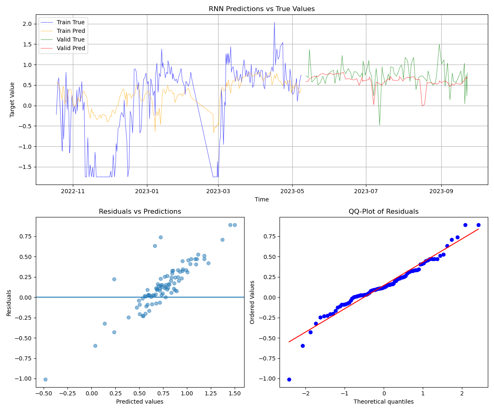
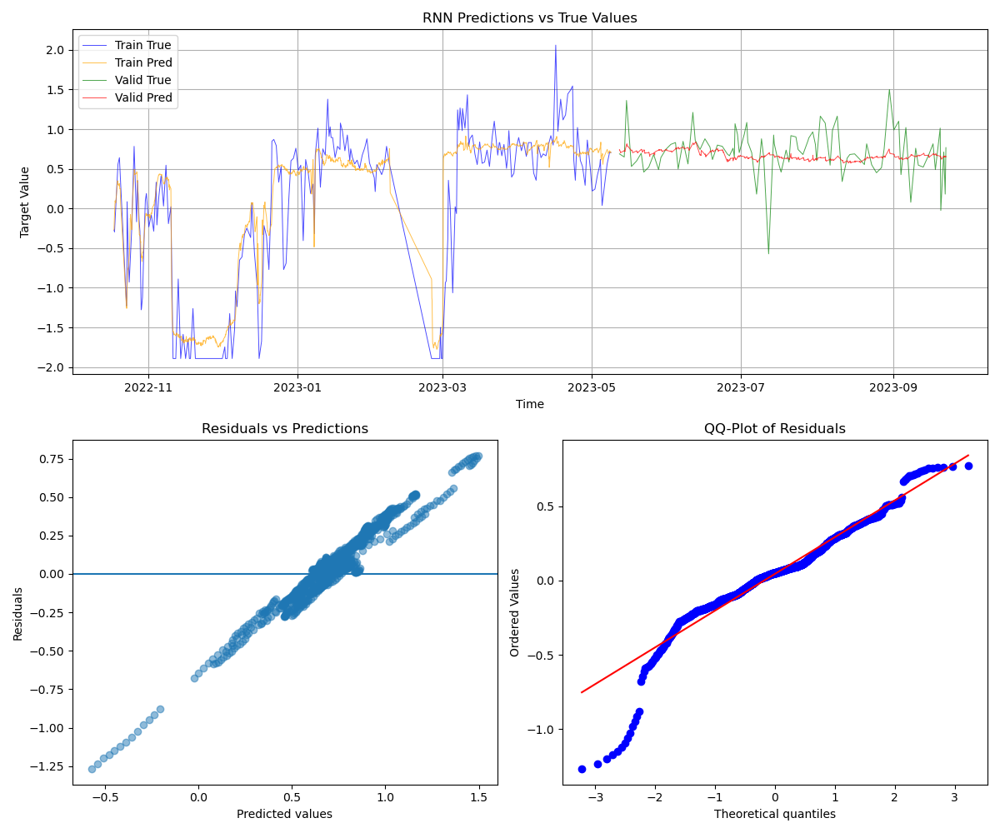

# Базовая обработка

Данные были обработаны, клипом аномальных значений. Подробно все параметры эксеперимента можно посмотреть в файлах конфигурации: [configs](./configs/).
Все данные предствлены для лучших найденых параметров, описанных в файлах конфигурации.

# Обучение на сырых данных

Использовалась конфигурация [data_raw_params.json](./configs/data_raw_params.json). Лучшего у меня добиться получилось только при сильном обрезании дат, оставляя только последнюю их часть: с 2023-03-17 и далее.
Возможно зависимости в данных со временем изменились, вследствие чего модель плохо улавливает зависимости. Хотя это кажется маловероятным для нефтеперерабатывающей станции.
Может быть в начальных данных много шума и не отражает реальных данных.

Полученые следующие метрики:  

Размер features: 8195  
Размер target: 324  
Отобранные признаки: ['81LILH40012', '81TI10126', '81TZHHH18022', '81TIHHH18021', '81TIH11116', '81FCL30063', '81TI10125', '81TIH12107']  

| Metric             | Train        | Valid     |
|--------------------|-------------|----------|
| MAE                | 6.294360e-01 | 0.242125 |
| rMSE               | 8.077420e-01 | 0.322497 |
| MAPE               | 1.794203e+00 | 0.495324 |
| Pearson (p-value)  | 3.007747e-41 | 0.055255 |
| Pearson            | 7.417003e-01 | 0.203930 |
| R2                 | 3.568257e-01 | -0.302849 |
| Hinge              | 6.294360e-01 | 0.242125 |

Модель плохо уловила зависимости. Ошибки имеют явную скошенность. В целом модель нельзя использовать для предсказаний.

# Обучение на интерполирированных данных

Использовалась конфигурация [data_interp_params.json](./configs/data_interp_params.json).  Аналогично сырым данным, лучшего у меня добиться получилось только при сильном обрезании дат.

Получены следующие характеристики:  

Размер features: 8195  
Размер target: 3865  
Отобранные признаки: ['81TI10127', '81LILH40012', '81TZHHH18022', '81TZ18007', '81PZLLLH28021', '81FCL30069', '81TIH11317', '81TIH11305']  
Они отличаются от признаков отобранных в случае без интреполяции.

| Metric             | Train    | Valid    |
|--------------------|----------|----------|
| MAE                | 0.267992 | 0.186238 |
| rMSE               | 0.390649 | 0.258639 |
| MAPE               | 1.267505 | 9.465261 |
| Pearson (p-value)  | 0.000000 | 0.000155 |
| Pearson            | 0.926630 | 0.113837 |
| R2                 | 0.849150 | -0.026990 |
| Hinge              | 0.267992 | 0.186238 |
  

Характеристики не выглядят хорошими и смещение остатков явно аномальное. Модель также малопригодна для предсказаний.
